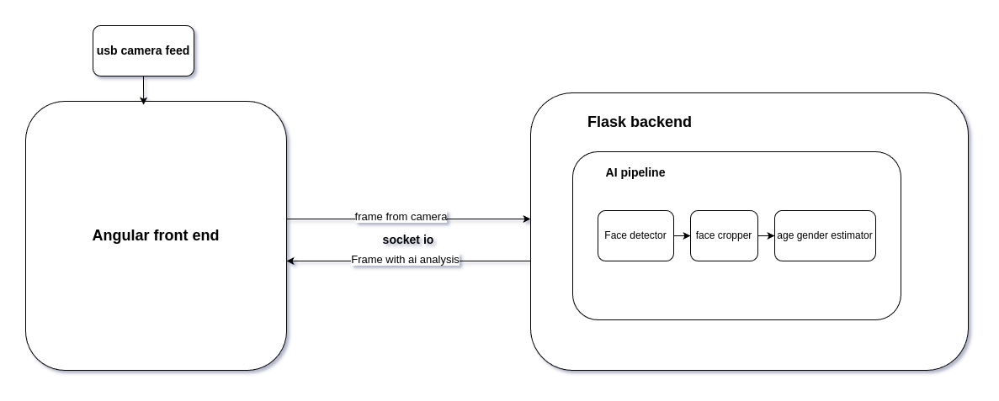

# Demographic Analysis


## Overview
* This project leverages AI for demographic analysis by performing face detection followed by age and gender estimation. 
* the ai models are optimized with TensorFlow lite and runs in realtime on cpu.

## Architecture
The project uses angular for the frontend and Flask for the backend and uses websocket to stream the video feed.

## Project structure
the project structure is as following
* misc : contains data used in the readme.
* ai
    * age_gender: contains the training and optimization scripts for the age/gender estimation model
    * face_detector: contains the training and optimization scripts for the face detection model
* web_app
    * frontend: contains the frontend angular web app
    * backend: contains the flask backend and the AI pipeline and models.

## Getting started
* clone the repo and cd into it
```bash
git clone https://github.com/AhmedGhazale/demographic-analysis.git
cd demographic-analysis
```
* install node.js [here](https://nodejs.org/en/download)
* install angular cli [here](https://angular.dev/installation#install-angular-cli)
* install miniconda [here](https://www.anaconda.com/download/success) and create conda environment and run it #Note: you can skip this if you want to use another python environment handler tool
```bask
conda create -n demographic_analysis  python=3.11
conda activate demographic_analysis
```
* install pytorch refer to https://pytorch.org/, or you can run
```bash
pip install torch torchvision torchaudio --index-url https://download.pytorch.org/whl/cu126
```
* install python requirements
```bash 
pip install -r requirements.txt
``` 
* to get started with AI model training and optimization go to [ai](ai/) folder.
* to get started with running the web app go to [web_app](web_app) folder.

## results
youtube demo video.   
[](https://www.youtube.com/watch?v=blZiJh9m8co)

## next steps(Bonus)

* we can estimate where the people are looking at by performing head pose estimation [for reference](https://github.com/thohemp/6drepnet360).
* we can extend the demographic analysis by performing ethnicity detection and emotion detection, this can be done by training machine learning models on corresponding datasets and easily integrate these models in the AI pipeline.  

