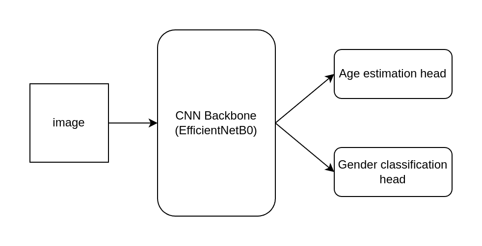
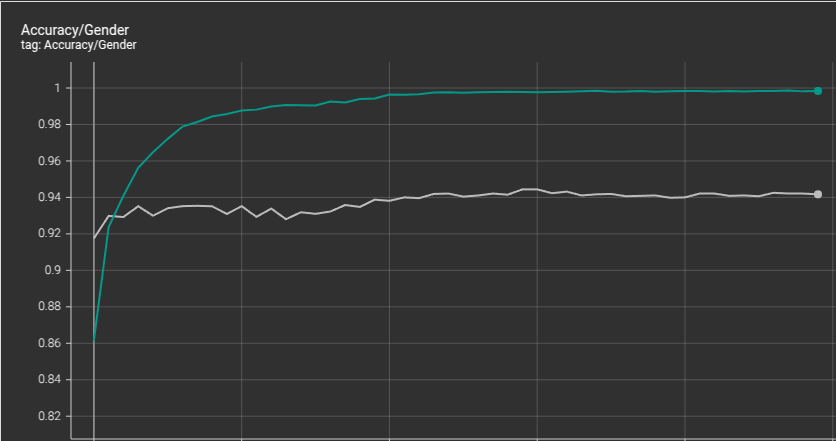

# Age/Gender Estimation model

## architicture
* the model is a implemented as a MultiTaks model.
* it uses [pytorch image models](https://github.com/huggingface/pytorch-image-models) to create a CNN backbone for feature extraction.
* it has 2 heads:
    * gender classification head: a binary classification head to classify the gender (male / female).
    * age estimation head: a regression head to estimate the age (1 -> 116).
* for details about model implementation refer to [model.py](./model.py)
* the model is trained jointly on the 2 tasks, refer to [train.py](./train.py) for implementation details.

## Getting started
* download UTKFace dataset from [here](https://www.kaggle.com/datasets/jangedoo/utkface-new).
* put it *dataset/* folder and extract it.
* to train run:
``` bash
python3 train.py --data_dir dataset/UTKFace --log_dir exp2 --backbone efficientnet_b0 --batch_size 32 --lr 1e-4 --epochs 50 
```
* you can see the list of all avaialbe backbone [here](https://github.com/huggingface/pytorch-image-models/blob/main/results/results-imagenet.csv)
* to convert the model to tensorflow lite run (Note: this will convert the model I trained inside exp1 folder, to convert your model update the model path in the script)
``` bash
python3 convert_to_tflite  
```
## results
a training trial was done (using the same parameters as training comand above) and achived the follwing.
* on the Gender classifcation task the model achives
    * **99%** accuracy on **training** set.
    * **94%** accuracy on **validatoin** set.

* on age estimation task the model achives
    * ~**2.9** mean absoulte error on **training** set. 
    * ~**5.5** mean absoulte erro on **validation** set.   
gender classification accuracy.   
   
age estimation normalized l1 loss.   
   
* After optimization using tensorflow lite the model size is only ~**5MB**.