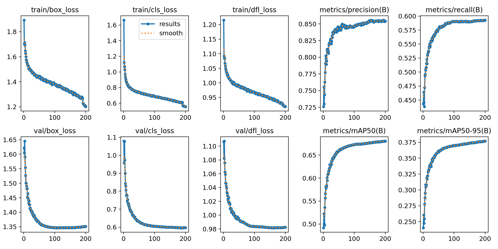
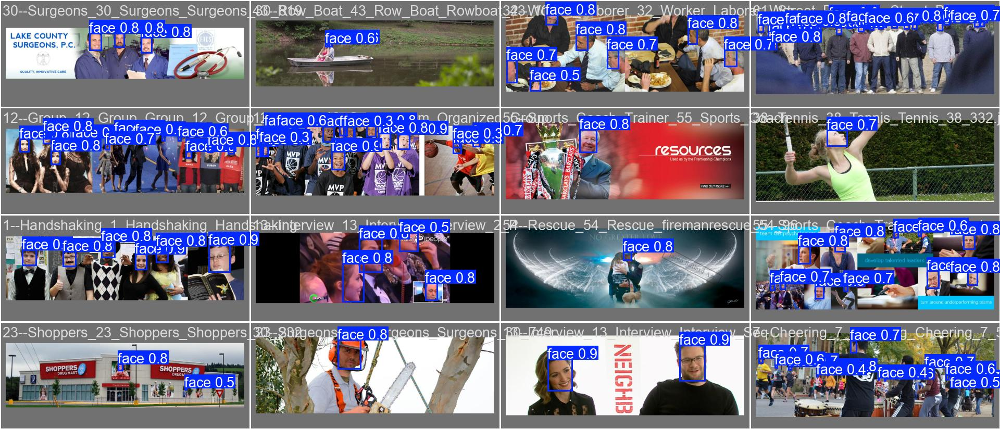

# Age Gender Estimation model

## Architecture
* YOLO v11 nano variant from [ultralytics](https://github.com/ultralytics/ultralytics) is used .

## Getting started
* download wider face dataset from [here](http://shuoyang1213.me/WIDERFACE/) (we need WIDER Face Training Images, WIDER Face Validation Images and Face annotations).
* put it in *widerface/* folder and extract it.
* to convert the dataset to YOLO format run
```bash
python3 widerface_to_yolo.py
```
* to train run:
``` bash
python3 train.py 
```
* to convert the model to tensorflow lite run (Note: this will convert the model I trained inside *runs/detect/train* folder, to convert your model update the model path in the script)
``` bash
python3 convert_to_tflite.py
```
## Results
### Training
the model achived 
* mAP50-95 of **37.7%**.
* mAP50 of **68.0%**.     

results:    
    

sample predictions on validation set    
    

### TFLite conversion
* After optimization using tensorflow lite the model size is only ~**5.4MB**.

